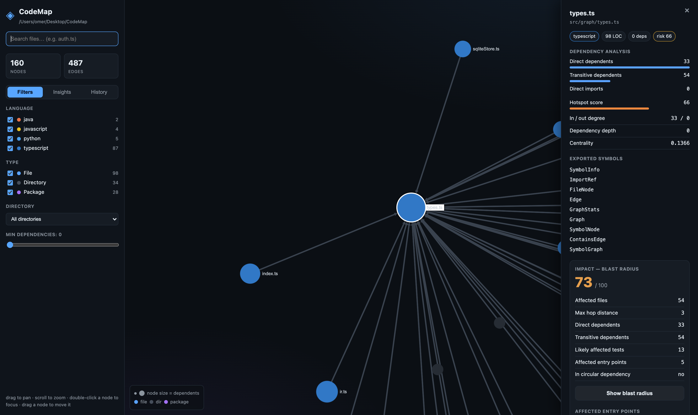
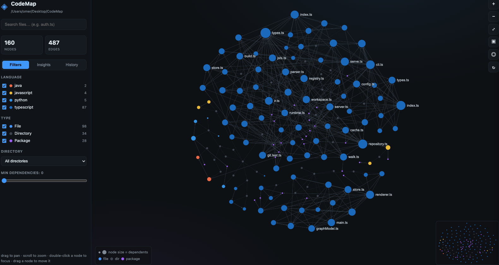

# CodeMap


**Google Maps for codebases.** Point CodeMap at any repository and get an interactive architecture map — files, folders, imports, exports, functions, classes, and the dependency graph that connects them. Local-first: everything runs on your machine, nothing leaves it.

Supports **Python, JavaScript, TypeScript, and Java** today, via a small language-plugin system.

📦 **[npmjs.com/package/@omertt27/codemap](https://www.npmjs.com/package/@omertt27/codemap)**



---

## Requirements

- **Node.js ≥ 22** (uses `node:sqlite`, WASM, worker threads). Check with `node -v`.
- **git** — only needed for the history/time-machine features.
- No other system dependencies: tree-sitter runs as WebAssembly, so nothing to compile.

## Setup

```bash
npm install -g @omertt27/codemap
```

That's it. The `codemap` command is now available globally:

```bash
codemap serve /path/to/your/repo
```

**Alternative — run without installing:**

```bash
npx @omertt27/codemap serve /path/to/your/repo
```

**Development setup (contributing):**

```bash
git clone https://github.com/omertt27/CodeMap codemap && cd codemap
npm install   # installs deps and builds automatically (via prepare hook)
npm link      # makes `codemap` available globally from source
```

## Everyday use

```bash
codemap serve /path/to/repo     # open the interactive map in your browser (start here)
codemap scan /path/to/repo      # write .codemap/graph.json + architecture-summary.json
codemap governance /path/to/repo  # health score, violations, trend
codemap analyze-pr /path/to/repo  # architecture impact of the current branch vs main
codemap report /path/to/repo    # generate HTML + Markdown + JSON reports
codemap insights /path/to/repo  # cycles, hotspots, God modules, unused, layer violations
codemap impact src/auth.ts      # "what breaks if I change this?" (blast radius)
codemap history /path/to/repo   # churn, stability, evolution insights (needs git)
codemap diff HEAD~30 HEAD       # architecture diff between two revisions
codemap export /path/to/repo    # stable JSON for other tools / AI agents
codemap mcp /path/to/repo       # run as an MCP server for AI agents (stdio)
```

Everything CodeMap writes goes in a `.codemap/` folder inside the scanned repo
(graph, caches, reports) — add it to your `.gitignore`. Nothing leaves your machine.

During development you can skip the build with `npm run dev -- <command>` (runs the
TypeScript directly via `tsx`).

## Commands

| Command | What it does |
| --- | --- |
| `codemap scan [path]` | Scan a repo, extract structure, write the graph to `.codemap/graph.json`. `--json` prints the raw graph to stdout. |
| `codemap serve [path]` | Serve the interactive map on `http://127.0.0.1:4321`. `--rescan` forces a fresh scan, `--port <n>` changes the port, `--no-open` skips launching the browser. |
| `codemap summary [path]` | Print hubs, connectors, folders, external packages, and import cycles to the terminal. |
| `codemap insights [path]` | Deterministic architecture analysis: circular deps, hotspots, possible God modules, possibly-unused files, layer violations. |
| `codemap governance [path]` | Run the rule engine against the scanned repo. Prints health score, grade, violations (errors + warnings), and trend. `--json`, `--fail-on <error\|warning\|none>`. Exits non-zero when rules fail (use in CI). |
| `codemap analyze-pr [path]` | Compare HEAD against a base branch. Reports health delta, new dependencies, blast radius change, new violations, new cycles, and coupling increases. `--base <branch>`, `--json`, `--fail-on-violations`. |
| `codemap report [path]` | Generate `architecture-report.html`, `architecture-report.md`, and `health-report.json` in `.codemap/`. `--out <dir>`, `--html`, `--md`, `--json`. |
| `codemap impact <file>` | Blast radius of changing a file — "what breaks if I change this?". Saves `.codemap/impact-report.json`. `--json`, `--root <path>`. |
| `codemap history [path]` | Repository evolution: churn heatmap, stability scores, evolution insights. `--json`, `--max <n>`. |
| `codemap diff <a> <b>` | Architecture diff between two revisions (added/removed/moved files, deps, cycles, hotspot & coupling shifts). `--json`. |
| `codemap replay [path]` | Sample the timeline and report how files/dependencies grew over history. `--steps <n>`, `--json`. |
| `codemap mcp [path]` | Run a local MCP server (stdio) exposing all analysis to AI agents. |
| `codemap export [path]` | Write a stable, schema-versioned graph document (files + edges + symbols) for AI agents and other tools. `--stdout`, `--compact`, `-o <file>`. |

### Configuration (optional)

Drop a `.codemap.json` at the repo root to tune scanning:

```json
{
  "exclude": ["**/*.min.js", "vendor/"],
  "languages": ["typescript", "python"]
}
```

`exclude` adds ignore patterns (gitignore syntax) on top of `.gitignore` and built-in
defaults; `languages` restricts the scan to a subset. Both are optional.

## Architecture Governance

CodeMap is an **architectural guardian** — not just a visualisation tool. It continuously monitors repository health and prevents architectural decay using deterministic rules and graph algorithms (no LLMs).

### Quick start

```bash
# 1. Scan your repo
codemap scan /my/project

# 2. Check architecture health
codemap governance /my/project

# 3. Generate reports (HTML + Markdown + JSON)
codemap report /my/project

# 4. Open the browser UI — includes a Governance tab
codemap serve /my/project
```

### Health Score

Every scan computes a **0–100 health score** with a letter grade (A–F) and five sub-scores:

| Category | What it measures |
| --- | --- |
| **Maintainability** | Complexity + hotspot pressure + violation count |
| **Stability** | Coupling volatility, cycle ratio, hotspot average |
| **Modularity** | Cycle ratio, dead-code ratio |
| **Coupling** | Average fan-in + fan-out degree across files |
| **Complexity** | Average LOC, function count, God module ratio |

The score is fully deterministic — the same graph always produces the same score, so the number is meaningful **as a trend**.

### Configure rules (`codemap.config.json`)

Drop a `codemap.config.json` at your repo root to customise the rule engine:

```json
{
  "rules": {
    "maxDependencyDepth": 8,
    "maxFunctionCount": 30,
    "maxImports": 20,
    "maxFanIn": 25,
    "maxCoupling": 40,
    "maxFileSize": 400,
    "allowCircularDependencies": false
  },
  "forbiddenImports": [
    {
      "from": "src/ui/**",
      "to": "src/db/**",
      "message": "UI layer must not access the database directly."
    },
    {
      "from": "src/shared/**",
      "to": "src/features/**",
      "message": "Shared utilities cannot depend on feature modules."
    }
  ],
  "failOn": "error"
}
```

All fields are optional — defaults are applied for anything omitted. `failOn` controls when CI fails: `"error"` (default), `"warning"`, or `"none"`.

Rules supported:

| Rule | Default | What triggers it |
| --- | --- | --- |
| `maxDependencyDepth` | 10 | Transitive import depth exceeds limit |
| `maxFunctionCount` | 40 | File declares more functions than limit |
| `maxImports` | 25 | File imports more files than limit (fan-out) |
| `maxFanIn` | 30 | More files import this file than limit |
| `maxCoupling` | 45 | fan-in + fan-out exceeds limit |
| `maxFileSize` | 500 | File exceeds N lines of code |
| `allowCircularDependencies` | false | Any import cycle is an error |
| `forbiddenImports` | [] | Glob-based import pair is forbidden |

Layer rules from `repo-map.config.json` are also enforced as custom rules.

### PR / branch analysis

```bash
# Compare the current branch against main (auto-detected)
codemap analyze-pr

# Specify the base branch explicitly
codemap analyze-pr --base develop

# In CI — exits non-zero if new violations are introduced
codemap analyze-pr --fail-on-violations
```

Reports for each PR:

- Health score **before → after** with delta
- **New dependencies** introduced
- **Blast radius increase** (total coupling delta)
- **New cycles** created / resolved
- **New violations** vs resolved ones
- **New hotspots** and files with worsened scores
- Files with **increased coupling**

### CI with GitHub Actions

Copy `.github/workflows/architecture.yml` from this repo into your project, or create one:

```yaml
name: Architecture Governance

on: [push, pull_request]

jobs:
  architecture:
    runs-on: ubuntu-latest
    steps:
      - uses: actions/checkout@v4
        with:
          fetch-depth: 0          # full history for PR analysis

      - uses: actions/setup-node@v4
        with:
          node-version: 22
          cache: npm

      - run: npm install -g @omertt27/codemap

      - run: codemap scan .
      - run: codemap governance . --fail-on error
      - run: codemap analyze-pr . --fail-on-violations
        if: github.event_name == 'pull_request'
        env:
          GITHUB_BASE_REF: ${{ github.base_ref }}

      - run: codemap report . --out .codemap

      - uses: actions/upload-artifact@v4
        if: always()
        with:
          name: architecture-reports
          path: |
            .codemap/architecture-report.html
            .codemap/architecture-report.md
            .codemap/health-report.json
```

### Governance in the browser UI

`codemap serve` includes a **Governance tab** that shows the full dashboard without running the CLI manually:

- Health score ring (0–100) + letter grade
- Sub-score bars (Maintainability · Stability · Modularity · Coupling · Complexity)
- Trend sparkline — health across all historical scans
- Full violations list (errors and warnings), grouped by severity
- Top hotspots with one-click focus on the map

### Reports

```bash
codemap report /my/project
# Writes to .codemap/:
#   architecture-report.html   — self-contained, dark-themed, easy to attach to a PR
#   architecture-report.md     — paste into GitHub PR descriptions or wikis
#   health-report.json         — machine-readable, for dashboards and other tools
```

Use `--out <dir>` to write to a different directory.

### Governance API

`codemap serve` exposes `GET /api/governance` returning the full `GovernanceResult` as JSON — consumed by the browser UI and available to any external tool or dashboard.

### Query API

`codemap serve` also exposes a query-oriented HTTP API over the graph — the surface a
windowed UI or an AI agent would use instead of downloading the whole graph:

| Endpoint | Returns |
| --- | --- |
| `GET /api/stats` | file/edge/language counts |
| `GET /api/search?q=&limit=` | files whose path matches |
| `GET /api/file?id=` | one file node's full metadata |
| `GET /api/neighbors?id=&dir=in\|out\|both&depth=` | a node's dependency neighbourhood |
| `GET /api/subgraph?folder=&minDegree=&limit=` | a windowed subgraph |

These are backed by a `GraphStore` interface (`src/graph/store.ts`) so a SQLite-backed
store can replace the in-memory JSON one without changing any consumer.

## The interactive map



A **GPU-accelerated** map (Sigma.js / WebGL — no SVG) that stays fluid into the
thousands of nodes. Renders **files, directories, and dependencies** from the
generic graph.

- **Navigate:** smooth pan, mouse-wheel/infinite zoom, drag nodes, double-click to focus, fit-to-screen, and a click-to-jump **minimap**.
- **Search** (`auth.ts`) — dims non-matches live and centers the node on select.
- **Click a node → inspector**: file path, language, imports (internal + external), exported symbols, classes, functions, and dependency count — all lazily fetched from the parser via `/api/file`. Parser data only, no AI.
- **Filter** by language, node type, directory, and minimum dependency count — updates instantly via render reducers (no graph rebuild).
- Nodes are coloured by language/type and sized by import-degree.

**Architecture.** The UI (`ui/src/`) is modular ESM bundled offline by esbuild, with
each concern isolated behind a shared reactive store — `render/` (Sigma),
`state/` (store), `camera/`, `layout/` (a `LayoutEngine` interface with a
ForceAtlas2 implementation, so other layouts drop in), and `components/`
(sidebar, search, filters, minimap). Nothing is tightly coupled: components read
and write the store and never call each other. Clean extension points are left for
future overlays (semantic clusters, Git history, AI overlays, impact analysis) —
they become new store slices + reducer contributions without touching the renderer.

## How it works

```
repo ─▶ scanner ─▶ language parser ─▶ IR (ParsedFile[]) ─▶ GraphBuilder ─▶ CodeGraph ─▶ graph.json
        (discover)  (per language)     (language-agnostic)   (language-unaware)
```

Parsing and graph construction are fully separated:

- **Scanner** (`scanner/`) discovers source files, respecting `.gitignore`, config `exclude`, and built-in ignores (`node_modules`, `dist`, `build`, `target`, `__pycache__`, `.venv`, …).
- **Language parsers** (`languages/`) each implement one interface — `initialize` / `canParse` / `parseFile` / `extractSymbols` / `extractRelationships` / `resolveImport` — over [tree-sitter](https://tree-sitter.github.io/) WASM grammars. They emit a language-agnostic **IR** (`ParsedFile`): file metadata (path, language, size, LOC), imports/exports, symbols (class, function, method, interface, enum, variable — with `extends`/`implements` and docstrings), and stored comments.
- **GraphBuilder** (`graph/builder.ts`) turns the IR into the generic graph. It never asks which language produced the data.

Nothing outside `languages/` depends on any specific language; adding one is a single new parser.

## Graph model

`codemap scan` writes a generic, language-agnostic graph to `.codemap/graph.json`:

```json
{ "nodes": [...], "edges": [...] }
```

**Node types:** `Repository`, `Directory`, `File`, `Class`, `Function`, `Method`, `Interface`, `Enum`, `Variable`, `Package`.
**Edge types:** `CONTAINS` (repo→dir→file, class→method), `DECLARES` (file→symbol), `IMPORTS` (file→file or file→package), `EXPORTS`, `EXTENDS`, `IMPLEMENTS` (`CALLS`/`USES` are reserved for later).

See `src/graph/model.ts` for the full model and `src/languages/ir.ts` for the parser IR. (The interactive UI and query API run on an in-memory file-level projection of the same data — `src/graph/build.ts`.)

## Architecture intelligence

A standalone, deterministic analyzer (`src/analysis/` — no AI, no UI dependency)
turns the dependency graph into insight. `codemap scan` runs it, prints an
**Architecture Summary**, and saves `.codemap/architecture-summary.json`;
`codemap insights` prints the detail; the UI's **Insights** panel renders it and
clicking an item focuses/highlights the nodes on the map.

- **Dependency analysis** per file: direct/transitive imports & dependents, in/out degree, dependency depth (shown in the sidebar).
- **Circular dependencies** (Tarjan SCC) with files, length, severity, and a suggested edge to cut — plus a cycle-highlight mode.
- **Hotspots** — a 0–100 score from dependents, PageRank centrality, dependencies, size, and public-API width; each explains *why*.
- **Possible God modules** — configurable thresholds (LOC, functions, classes, exports, dependents); flagged only when several trip at once.
- **Possibly unused files** — conservative: no dependents **and** unreachable from entry points (tests count as entries).
- **Layer violations** — a small rule system (`repo-map.config.json`).

```json
{
  "layers": [
    { "name": "ui", "patterns": ["src/components/**", "src/pages/**"] },
    { "name": "database", "patterns": ["src/db/**", "src/models/**"] }
  ],
  "rules": [{ "from": "ui", "cannotImport": ["database"] }]
}
```

The analyzer is reusable as-is by the CLI, UI, and (later) an MCP server, an AI
assistant, or CI checks — it consumes the graph and returns plain data.

### Impact analysis (blast radius)

`src/impact/` (a separate module, `… → architecture analyzer → impact analyzer → UI`)
answers **"what breaks if I change this file?"** via reverse dependency traversal.

- **Reverse BFS** assigns every dependent a **hop distance** (0 = target, 1 = direct, 2+ = transitive) and a reason (`imports …`).
- **Blast-radius score (0–100)** from affected count, max depth, affected entry points, affected tests, target centrality, and cycle participation.
- **Likely affected tests** — by transitive import *and* by name (`session.ts` → `session.test.ts`).
- **Affected entry points** — main/CLI/app/server files, API routes, pages/routes.
- In the UI, **"Show blast radius"** paints the map by hop (source → red → orange → amber, unaffected dimmed); clicking any affected node shows *why* it's affected.

`codemap impact <file>` prints the report and writes `.codemap/impact-report.json`;
the server exposes `/api/impact?id=<file:path>`.

### Git Time Machine (architectural evolution)

`src/git/` (a separate module — git logic is never coupled to parsing or
rendering; pipeline `… → impact analyzer → git evolution analyzer → UI`) shows how
the architecture changed over time.

- **Historical snapshots** — the parser rebuilds the dependency graph for *any*
  revision by reading blobs from git objects (`git show <rev>:<path>`); the working
  directory is never touched.
- **Code churn heatmap** — files coloured cool→hot by how often they change (Very Low → Extreme).
- **Stability score (0–100)** — from commit frequency, author count, and churn (shown in the sidebar).
- **Architecture diff** — added/removed/moved files, added/removed dependencies, new/resolved cycles, hotspot & coupling shifts.
- **Evolution insights** — most changed module, fastest-growing/most-stable subsystem, newest layer, most-volatile file, modules becoming more/less coupled.
- **History panel** — a timeline slider scrubs revisions and the map morphs (shared nodes keep their positions, new ones seed near their neighbours), a Replay button plays through history, plus a diff view.

Endpoints: `/api/history`, `/api/timeline`, `/api/snapshot?rev=`, `/api/diff?a=&b=`.

## Scaling to large codebases

CodeMap is built to handle company-scale monorepos:

- **Incremental parse cache** — files are content-hashed; a re-scan only re-parses what changed (`scan` reports `N cached, M parsed`). Warm scans are ~4× faster.
- **Worker-pool parsing** — parsing fans out across CPU cores once a repo is large (~2.7× on a 600-file tree; auto above `CODEMAP_WORKER_THRESHOLD`, default 400). Output is byte-identical to the single-threaded path.
- **SQLite store** — `SqliteGraphStore` (`src/graph/sqliteStore.ts`, built on `node:sqlite`) implements the same `GraphStore` interface as the in-memory one, with SQL search and a recursive-CTE dependency BFS, so the whole graph needn't live in RAM.
- **Analysis cache** — PageRank/cycles/hotspots are cached by a structural hash; unchanged trees skip the recompute.
- **Monorepo awareness** — detects npm/yarn/pnpm workspaces, maps files to packages, and rolls up per-package files/LOC/cross-package deps (`/api/packages`). The map's folder view groups by **package boundary** when present.
- **Semantic zoom / drill-down** — the map collapses to one node per folder/package (▣ toolbar) and **double-clicking a folder drills into its files**; very large repos start in this view to stay responsive.
- **Git at scale** — historical snapshots read all blobs via a single `git cat-file --batch` process instead of one `git show` per file.

## MCP server — architecture intelligence for AI agents

`codemap mcp [path]` runs a local [Model Context Protocol](https://modelcontextprotocol.io)
server over stdio that gives an AI coding agent a **structured navigation layer** for
the repo — so instead of repeatedly running `grep`/`find`/`cat`, it queries the
architecture graph. **No LLM calls happen inside CodeMap**: every tool returns
deterministic, structured JSON (never prose); the agent's model does the reasoning.
**Read-only by design** — tools never execute code, write files, or read arbitrary
paths; they only expose graph + git metadata. `src/mcp/` reuses the existing pipeline
via a cached per-repo workspace with a session cache (invalidated on `scan_repo`).

**20 tools**, grouped:

- **Repository:** `get_repository_summary`, `scan_repo`
- **Search:** `search_symbol`, `search_file`, `search_imports`
- **Architecture:** `get_hotspots`, `get_cycles`, `get_layer_violations`
- **Impact:** `impact_analysis`, `dependency_path`
- **Git:** `history`, `compare`
- **Navigation:** `find_entry_points`, `find_api_routes`, `find_database_models`, `find_configuration`, `find_tests`, `find_unused`, `find_dead_code`
- **Context:** `build_context` — given a request like *"modify authentication"*, returns only the relevant slice (related files, their dependency neighbourhood, affected modules, an architecture summary, hotspots, git history) instead of the whole repo. Token-optimised.

### Shared human/agent workspace

When `codemap serve` is running and the MCP server is started with
`CODEMAP_SERVE_URL=http://127.0.0.1:4321`, agent queries **light up the map**: an
impact query paints the blast radius, `get_cycles` highlights the cycle,
`build_context`/`find_*` highlight the relevant nodes — a shared view for you and the
agent. (Server-Sent Events; the UI subscribes to `/api/events`.)

Register it with an MCP client, e.g. Claude Code:

```bash
claude mcp add codemap -- node /abs/path/to/CodeMap/dist/cli.js mcp /abs/path/to/your/repo
```

or in an MCP client config:

```json
{
  "mcpServers": {
    "codemap": { "command": "node", "args": ["/abs/path/to/CodeMap/dist/cli.js", "mcp", "/abs/path/to/your/repo"] }
  }
}
```

Now an agent can ask *"what breaks if I change `auth/session.ts`?"* or *"where are
the architectural hotspots and cycles?"* and get grounded, deterministic answers.

## Project layout

```
src/
  cli.ts                 CLI entrypoint (scan / summary / export / serve)
  config.ts              optional .codemap.json (exclude globs, language filter)
  languages/             language parsers — add a language here, nothing else changes
    parser.ts            LanguageParser interface + TreeSitterParser base class
    ir.ts                language-agnostic parser output (ParsedFile, ParsedSymbol)
    ast.ts               shared tree-sitter helpers
    registry.ts          the one place languages are registered
    runtime.ts           shared tree-sitter (WASM) runtime
    jsts.ts python.ts java.ts   the concrete parsers
  scanner/walk.ts        file discovery + .gitignore + built-in ignores
  scanner/repository.ts  parse coordinator → ParsedFile[] (IR)
  graph/model.ts         generic CodeGraph (nodes/edges) — the canonical output
  graph/builder.ts       language-unaware GraphBuilder: IR → CodeGraph
  graph/build.ts         in-memory file-level projection (UI / API / export)
  graph/store.ts         GraphStore interface + in-memory JsonGraphStore
  graph/summary.ts       hubs, connectors, cycles (Tarjan SCC), externals
  storage/json.ts        save/load .codemap/graph.json
  storage/export.ts      stable, schema-versioned export document
  graph/mapView.ts       compact map projection served to the visualization
  analysis/              deterministic architecture analyzer (UI-independent)
    graph.ts             dependency index + PageRank + reachability
    cycles.ts hotspots.ts godModules.ts deadCode.ts layers.ts
    metrics.ts config.ts index.ts
  impact/                deterministic blast-radius analyzer (reuses analysis/)
    impact.ts detect.ts index.ts
  git/                   git evolution analyzer (never touches the working tree)
    git.ts               git CLI wrapper (log, branches, tags, numstat)
    snapshot.ts          parse any revision from git objects
    history.ts diff.ts index.ts
  mcp/                   architecture-intelligence MCP server (reuses everything above)
    server.ts            20 tools (structured JSON, read-only)
    workspace.ts         cached per-repo artifacts + session query cache
    contextBuilder.ts    query → relevant context slice (token-optimised)
    navigation.ts        find_* detectors  ·  symbols.ts  symbol search
  governance/            architecture governance (rule engine, health, trend, PR analysis, reports)
    config.ts            load codemap.config.json (thresholds + forbidden imports)
    rules.ts             rule evaluator → RuleViolation[]
    health.ts            0-100 health score + 5 sub-scores
    trend.ts             persist + compare health snapshots over time
    pr.ts                PR/branch analysis (health delta, new deps, new cycles, violations)
    report.ts            HTML / Markdown / JSON report generators
    index.ts             governance orchestrator (runGovernance, governanceFails)
  server/serve.ts        local UI server + query API + insights + impact + history + governance
  util/paths.ts          small path helpers
ui/                      the interactive map (WebGL)
  index.html style.css
  src/render/            Sigma renderer + theme
  src/state/             reactive store (single source of UI state)
  src/model/             graph model + types
  src/layout/            LayoutEngine interface + ForceAtlas2
  src/camera/            camera controls
  src/components/        sidebar, search, filters, minimap, insights, history, governance
  src/main.ts            composition root
schema/                  codemap.schema.json (frozen export contract)
test/                    node:test suites + golden per-language fixtures
```

The UI is bundled offline with esbuild (`npm run build:ui`, or `npm run dev:ui` to watch).

### Adding a language

Extend `TreeSitterParser` (or implement `LanguageParser` directly) with the
language's `extractSymbols` / `extractRelationships` / `resolveImport`, then add an
instance to `src/languages/registry.ts`. The scanner, graph builder, and CLI are
language-agnostic — no other file changes. (Go, Rust, PHP, and more grammars are
available offline; Ruby's prebuilt grammar is currently ABI-incompatible with the
pinned tree-sitter runtime.)

## Development

```bash
npm run build      # compile TypeScript to dist/
npm run typecheck  # type-check without emitting
npm test           # node:test suites + golden per-language fixtures
```

Tests cover the pure units (import resolution, walk/ignore rules, summary analytics,
symbol derivation) and run full `buildGraph` golden tests over on-disk fixture repos
in `test/fixtures/` (TypeScript ESM, Python packages, CommonJS `require`). CI runs
typecheck + build + tests on every push and PR.

## Known limitations

- **Languages:** Python, JavaScript, TypeScript, and Java today. Go/Rust/PHP grammars are available and easy to add; **Ruby's** prebuilt grammar is currently ABI-incompatible with the pinned tree-sitter runtime.
- **`node:sqlite`** (used by the optional SQLite store) is an experimental Node API and prints a warning; the default pipeline uses the in-memory store.
- **Worker-pool parsing** engages only from the built `dist/` (not the `tsx` dev loader).
- Verified primarily on **macOS**; Windows/Linux should work (paths, browser-open, and worker URLs account for them) but are not yet CI-tested cross-platform.
- Not included (by design, for now): AI/LLM explanations, embeddings/semantic clustering, runtime tracing, and cloud/collaboration. The deterministic foundation is built so those can layer on cleanly.

## License

[MIT](LICENSE)
